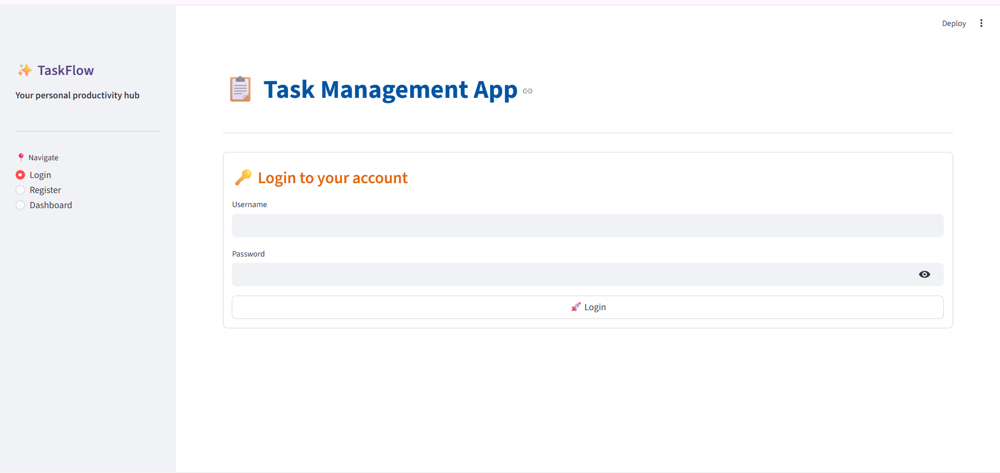
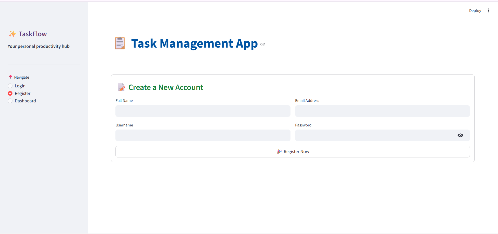
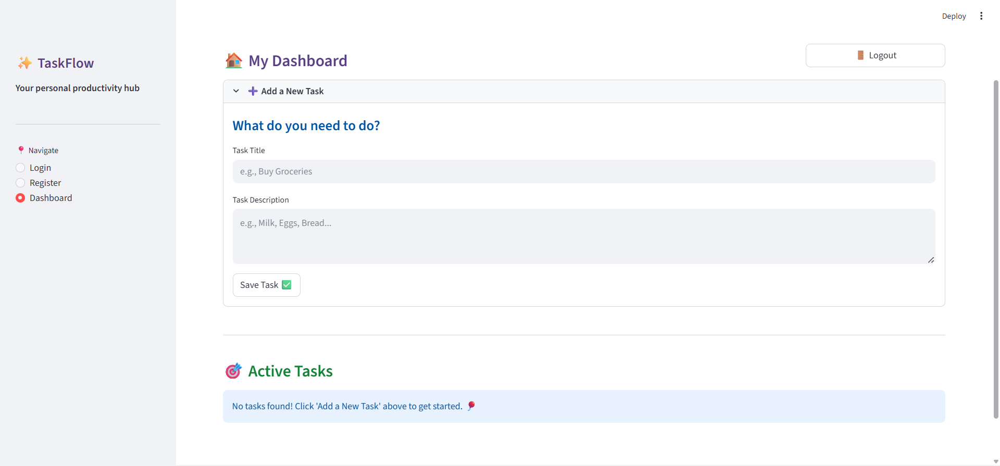
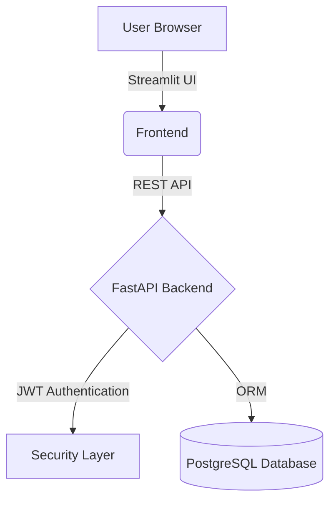

# 📋 Task Management Web Application

<div align="center">


**A high-performance full-stack Task Management system built with FastAPI, Streamlit, and PostgreSQL.**

[API Docs](http://127.0.0.1:8000/docs) · [Report Bug](https://github.com/ashishjaiswar21/Task-Management-Web-Application/issues) · [Request Feature](https://github.com/ashishjaiswar21/Task-Management-Web-Application/issues)

</div>

---

## 📖 Overview

This project is a **secure productivity web application** where users can register, login, and manage their tasks.

The backend is powered by **FastAPI**, the frontend uses **Streamlit**, and data is stored in **PostgreSQL**.

The application implements **JWT authentication** to protect API routes and maintain secure communication between frontend and backend.

---

## 🖼️ Application Preview

| 🔐 Login | 📝 Register |
|---|---|
|  |  |

| 📊 Dashboard | ✏️ Update & Delete |
|---|---|
|  |  |

---

## 🚀 Core Features

- 🔐 **JWT Authentication & Authorization**
- 📋 **Create Tasks**
- ✏️ **Update Tasks**
- ❌ **Delete Tasks**
- 📊 **View Task Dashboard**
- ⚡ **FastAPI Async Backend**
- 🌐 **REST API Architecture**
- 🗄 **PostgreSQL Database Integration**
- 🎨 **Interactive Streamlit UI**

---

## 🛠️ Tech Stack

### Backend
- FastAPI
- Python
- SQLAlchemy
- Alembic
- JWT Authentication

### Frontend
- Streamlit
- Requests Library

### Database
- PostgreSQL

### Tools
- Git
- GitHub
- VS Code
- Render (Deployment)

---

## 🏗️ System Architecture


***

## 📂 Project Directory Structure

```text
Task-Management-Web-Application/
├── 📁 backend/                # FastAPI Microservice
│   ├── 📁 src/                # Source Code
│   │   ├── 📁 tasks/          # Task Logic (Routers, Models, Schemas)
│   │   ├── 📁 user/           # Auth & Identity Management
│   │   └── 📁 utils/          # Shared Utilities & Middleware
│   ├── main.py                # FastAPI Application Entry Point
│   ├── database.py            # DB Connection & Session Logic
│   └── requirements.txt       # Backend Dependencies
├── 📁 frontend/               # Streamlit Dashboard
│   ├── streamlit_app.py       # Auth UI (Login/Register)
│   └── streamlit_app2.py      # Main Task Dashboard
├── 📁 images/                 # README Assets & Screenshots
├── .gitignore                 # Files to exclude from Git
└── README.md                  # Project Documentation
```

# ⚙️ Installation & Deployment

## 1️⃣ Clone the Repository
```bash
git clone [https://github.com/ashishjaiswar21/Task-Management-Web-Application.git](https://github.com/ashishjaiswar21/Task-Management-Web-Application.git)
cd Task-Management-Web-Application
```

## 2️⃣ Backend Configuration

### Initialize Environment
```bash
python -m venv env
source env/bin/activate  # Windows: .\env\Scripts\activate

# Install & Run
cd backend
pip install -r requirements.txt
uvicorn main:app --reload
```

## 3️⃣ Frontend Configuration
```bash
cd ../frontend
streamlit run streamlit_app2.py
```

# 👨‍💻 Author
### Ashish Kumar Jaiswar

### GitHub:https://github.com/ashishjaiswar21

### LinkedIn:https://www.linkedin.com/in/ashishjaiswar21/

---

# ⭐ Support the Project
If you find this repository useful for your learning or work, please consider giving it a Star! 🌟


### Why this is better:
1.  **Badges**: Adds instant visual credibility.
2.  **Blockquotes & Alerts**: Using `> [!IMPORTANT]` highlights key setup details.
3.  **Horizontal Rules**: `***` creates clean sections.
4.  **Tables**: Organizes your screenshots so they don't take up too much vertical space.
5.  **Mermaid Flow**: Includes a text-based architecture chart.
